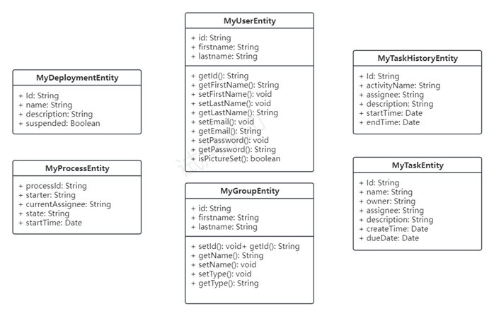
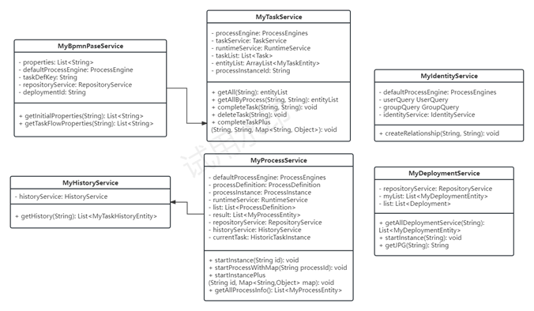
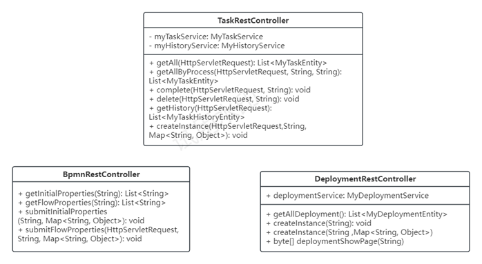
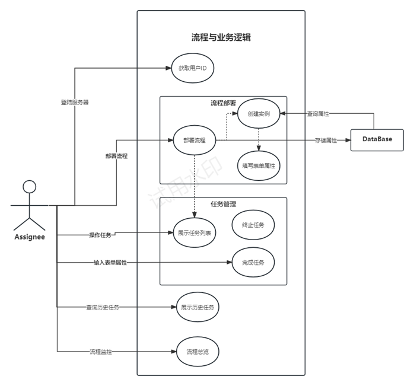

# 系统设计说明书
#设计说明
**成员：** 杨昊 张远驰 何宇轩
[toc]
**** 

## 程序模块设计
### 登录模块
&emsp;&emsp;登录模块由其他小组负责，在登录完成后打开与后端交互的Session，并使用唯一ID对用户进行标识。
&emsp;&emsp;此模块的设计是整个系统中至关重要的一部分。一旦用户成功登录，系统需要确保其身份得到正确验证并且能够与后端进行有效的交互。登录模块由专门的小组负责，他们的任务包括实现安全可靠的用户认证机制以及建立与后端服务器的通信通道。
&emsp;&emsp;在用户成功通过身份验证后，登录模块负责打开一个与后端交互的Session。这个Session将被用来在用户和服务器之间传递数据，并确保通信的安全性和完整性。此外，为了更好地管理用户会话，登录模块会为每个用户分配一个唯一的ID，这个ID将在整个会话期间用于标识和跟踪用户的操作。
&emsp;&emsp;登录模块的任务还包括管理用户的登录状态，例如处理用户的注销请求、管理会话过期时间等。通过有效的登录模块设计，整个系统能够保障用户信息的安全性，确保只有经过授权的用户才能够访问系统资源，从而提升系统的整体安全性和稳定性。
### BPMN绘制模块
&emsp;&emsp;**功能1**：为用户提供web页面绘制业务流程图，生成BPMN文件，将结果保存至本地。
&emsp;&emsp;该功能使用户能够通过系统的web页面绘制业务流程图，通过直观的图形界面轻松设计复杂的流程结构。用户可以在页面上拖拽各种BPMN元素，连接它们，并定义流程中的各个步骤和决策点。完成后，系统将生成对应的BPMN文件，用户可以选择将结果保存至本地，以便日后的查看、修改或分享。这种直观的可视化设计不仅降低了业务人员理解和参与业务流程建模的门槛，同时也有助于减少错误，提高工作效率。生成的BPMN文件可以轻松地与Activiti引擎等BPMN支持的系统进行集成，实现无缝的流程执行。
&emsp;&emsp;**功能2**：为用户提供流程图模板，辅助用户基于模板进行流程定义
&emsp;&emsp;除了自由绘制，系统还为用户提供了一系列流程图模板，包括一些通用的业务流程模型，以及特定行业或业务场景的模板。用户可以基于这些模板进行流程定义，从而加速流程设计的过程。这种模板化的设计方法有助于规范化业务流程的建模，提高流程的一致性，并降低业务分析人员的学习成本。
（BPMN 即 Business Process Model and Notation，是一种用于描述业务流程的图形标记语言，可以用来建模和文档化数据流程，通常用于业务流程管理和工作流程建模。Activiti 引擎提供了对 BPMN 良好支持，可以对其进行储存、解析等操作。）

### BPMN解析模块
&emsp;&emsp;**功能1**：解析BPMN中的必填字段，返回字段列表。
BPMN（Business Process Model and Notation）解析模块的第一个重要功能是对BPMN文件进行解析，识别其中的必填字段，并将它们以清晰的列表形式返回。必填字段的准确解析对于后续流程执行和管理至关重要，因为它确保了流程定义的完整性和正确性。通过该功能，系统能够提供用户友好的界面，展示解析后的字段，使用户能够轻松理解和验证流程定义。
&emsp;&emsp;**功能2**：任务执行过程中动态解析。
BPMN解析模块的第二个关键功能是在任务执行过程中实现动态解析。这意味着系统可以根据任务的实际执行情况，动态地解析和处理相关字段。这种灵活性使得系统能够适应不同的运行时情境，确保流程在执行过程中能够灵活应对变化。例如，当某个任务的输入参数发生变化时，系统可以动态调整解析策略，确保任务能够顺利执行。

### 流程部署模块
&emsp;&emsp;**功能1**：用户在 web 页面中选择 BPMN 文件，进行流程部署。
&emsp;&emsp;在流程管理系统中，流程部署模块的首要功能是为用户提供便捷的流程部署操作。通过系统的 web 页面，用户可以轻松地选择并上传BPMN文件，触发流程部署流程。这一功能的实现使得业务人员和流程管理员能够在无需深入技术细节的情况下，快速将业务流程引入系统中。

  流程部署是 activiti 启动的第一步，其重要性在于将业务流程转化为可执行的流程定义。在选择BPMN文件后，系统将解析该文件，提取流程定义、节点信息等关键数据，并将这些数据存储到数据库中。这样一来，系统就能够随时调取这些信息，确保在执行过程中能够准确地按照业务规则和流程逻辑进行操作。

  部署完的流程将被存储至数据库中，保存文件内容、流程定义相关的信息。这个步骤不仅为后续的流程执行提供了必要的基础数据，也确保了流程的可追溯性和管理性。通过数据库的存储，系统可以高效地检索、更新和管理各个流程的定义，使得流程部署模块成为流程管理系统中的关键组成部分。

流程部署模块的这两个功能共同为企业提供了简便而强大的流程引入和管理工具。用户可以通过直观的 web 界面完成流程部署，而系统则通过存储相关信息，为后续的流程执行奠定坚实的基础。这有助于提高业务的灵活性，降低引入新业务流程的门槛，从而推动整个企业的数字化转型。
### 启动实例模块
&emsp;&emsp;**功能1**：根据权限，向用户展示其可以访问的已部署流程。
启动实例模块的首要功能是基于用户权限向其展示可以访问的已部署流程。通过仔细管理和配置用户权限，系统能够确保用户只能看到其具备访问权限的流程列表。这种精确的权限控制不仅有助于信息安全，同时也简化了用户界面，使用户能够更迅速地找到并选择要发起的业务流程。

&emsp;&emsp;**功能2**：用户选择需要发起的流程，在弹窗中输入需要指定的属性，启动流程实例。
一旦用户在已部署流程列表中选择了目标流程，系统将为其提供一个便捷的弹窗界面，用于输入启动流程实例时需要指定的属性。这些属性可能包括任务执行人、截止日期、附加信息等。用户通过输入这些信息，可以根据具体的业务需求对流程进行个性化配置，以适应不同的场景和要求。

在用户输入完所需属性后，系统将启动流程实例。这一过程涉及了将流程定义转化为可执行实例的关键步骤。系统根据用户提供的信息，动态地生成并启动一个新的流程实例，使得流程能够按照预定的规则和逻辑在系统中运行。这种用户驱动的流程启动方式使得业务人员能够直接参与到流程管理中，提高了业务灵活性和响应速度。
### 任务操作模块
&emsp;&emsp;**功能1**：用户完成分配给其的某项任务。
任务操作模块的首要功能是让用户能够轻松完成其被分配的任务。通过清晰的界面和直观的操作流程，用户可以迅速了解任务的内容、要求以及可能的操作选项。完成任务的过程中，系统记录用户的操作，并确保任务的状态得到及时更新，以便后续流程的顺利进行。

&emsp;&emsp;**功能2**：为用户提供链接，查看与任务相关的信息。

为了提供更全面的任务信息，任务操作模块还为用户提供了链接，使其能够查看与任务相关的详细信息。这可能包括任务的历史记录、相关文档、流程图等。通过这些链接，用户能够深入了解任务的上下文，从而更好地理解任务的意义和目标。这种信息的透明性有助于用户更加全面地参与到任务的执行过程中，提高工作效率和任务执行的准确性。

### 历史记录模块
&emsp;&emsp;**功能1**：向用户展示正在分派给他，或曾经分派给他的任务。

历史记录模块的首要功能是为用户提供对已分派任务的全面视图。通过展示当前分派给用户的任务以及他曾经完成的任务，用户能够迅速查看自己的工作历史。这包括了当前进行中的任务，以及已经完成或取消的任务。这一功能有助于用户追踪工作进展，查找任务的上下文，并提供对过去工作的回顾。

&emsp;&emsp;**功能2**：历史记录过滤。

为了更好地管理和查找历史任务记录，历史记录模块提供了强大的过滤功能。用户可以根据不同的条件来过滤历史任务，如任务状态（已完成、进行中、已取消等）、时间范围、任务类型等。这种过滤机制使得用户能够快速定位到感兴趣的历史任务，从而更加高效地进行信息检索和分析。

通过历史记录模块，用户可以回顾自己的工作历程，了解任务的执行情况，同时系统也能够为用户提供更加智能的工作辅助。例如，系统可以根据历史记录生成工作报告、分析用户工作效率，以及提供个性化的推荐和建议。这进一步提高了用户对工作历史的理解和对未来工作的规划。

### 流程监控模块
&emsp;&emsp;**功能1**：记录流程进行的关键信息，便于统筹管理。

流程监控模块将实时采集流程执行过程中的关键信息，包括但不限于任务开始时间、任务完成时间、执行人员、关键事件等。通过实时数据采集，管理人员可以随时了解流程的当前状态，及时发现和解决潜在问题。

为了更好地了解流程的演变和趋势，功能1将关键信息以历史数据的形式进行存储，并提供强大的分析工具。通过对历史数据的深入分析，管理人员可以发现流程中的瓶颈、优化空间以及提高效率的方法，从而更好地指导和优化业务流程。

## 概要设计
### 实体类图

用户实体（MyUserEntity）：
以一个ID唯一标识，并存储了用户姓名信息，涵盖获取和设置用户个人信息的一系列方法

组实体（MyGroupEntity）：
以一个ID唯一标识，定义了一组相同类型的用户，涵盖获取和设置组信息的方法

部署实体（MyDeploymentEntity）：

流程实体（MyProcessEntity）：
属性：流程ID，创建者及创建时间，当前受委派人以及流程状态

任务实体（MyTaskEntity）：
属性：任务ID，任务名称，所有者，委派人，任务描述，创建时间以及截止日期

历史任务实体（MyHistoryTaskEntity）：
属性：任务ID，活动名称，委派人，任务描述以及起止时间

### Service类图

Bpmn解析类（MyBpmnParseService）：
方法：
1.	获取初始属性
2.	获取任务流属性

任务类（MyTaskService）：
方法：
1.	获取任务信息：获取属于该委派人所属的所有任务相关信息；返回任务实体列表
2.	完成任务：实现指定任务（以ID标识）的完成操作；用户通过页面完成任务按钮执行该操作
3.	删除任务：实现指定任务（以ID标识）的删除操作；用户通过页面删除任务按钮执行该操作

部署类（MyDeploymentService）：
方法：
1.	启动实例：启动指定ID的实例
2.	图像显示：将反应该流程部署的bpmn图显示至网络页面

流程类（MyProcessService）：
方法：
1.	启动实例：启动指定ID的实例
2.	启动流程：启动指定ID的流程
3.	获取所有流程：获取当前委派人所属的任务流的所有流程；返回流程实体列表

身份类（MyIdentityService）：
方法：创建身份关系：创建用户与某一组的对应关系

历史任务类（MyHistoryTaskService）：
方法：获取历史任务：获取当前用户的所有历史任务信息，返回历史任务实体列表

### Controller类图

Bpmn类（BpmnRestController）：
方法：通过调用MyBpmnParseService获取一系列属性
1.	获取初始属性
2.	获取任务流属性
3.	递交初始属性
4.	递交任务流属性

任务类（TaskRestController）：
方法：通过调用MyTaskService完成一系列任务相关操作
1.	获取任务信息：在前端展示属于该委派人所属的当前任务相关信息；
2.	完成任务：为用户提供实现指定任务（以ID标识）的完成操作的接口；
3.	删除任务：为用户提供实现指定任务（以ID标识）的删除操作的接口；
4.	获取历史任务信息：在前端展示属于该委派人所属的所有历史任务相关信息
5.	创建实例：

部署类（DeploymentRestController）：
方法：通过调用MyDeploymentService完成一系列部署相关操作
1.	获取所有部署信息
2.	创建实例：启动指定ID的实例
3.	图像显示：将反应该流程部署的bpmn图显示至网络页面

### 流程与业务逻辑用例图

## 整体架构
&emsp;&emsp;流程与业务逻辑模块基于 Activiti 逻辑引擎进行构建，并使用 Spring 框架整合。Activiti 是一个开源的业务流程管理（BPM）和工作流引擎，用于执行和自动化基于 BPMN 模型的业务流程。

### 登录
&emsp;&emsp;本模块使用该模块的用户都完成了登录，后端已经建立了 Session。登录模块由其他小组负责，我们需要的功能是在登录完成后打开与后端交互的 Session，并使用唯一ID对用户进行标识，将 ID 保存在会话中。本模块设计了类似的替代登录界面供调试使用，但没有对用户的身份信息做任何核验，知识单纯地获取了用户 ID。
### BPMN绘制
&emsp;&emsp;BPMN 绘制的页面有许多现成软件可以参考，且绘制 BPMN 图并非本项目重点。本项目提供前端配置BPMN的页面，使用户能基于我们的规则生成BPMN文件，并给用户提供页面以部署BPMN。
### 用户组分配
&emsp;&emsp;许多时候，某个任务可以同时被很多人看到，但只能有一个人进行处理。本模块提供用户组定义的接口，同时流程进行时也支持以组为单位的任务分配以及单角色任务认领。
&emsp;&emsp;
### BPMN解析
&emsp;&emsp;BPMN解析模块负责解析已部署流程中的未知属性，并区分他们在什么阶段是必填的。本模块支持动态填写流程中的属性，在流程实例化时部分属性为必填属性，需要在实例化之前完成填写，其余待填属性则须在任务流到达的时候填写。
### 流程部署
&emsp;&emsp;为用户提供界面上传绘制完成的BPMN图与流程图对应的图像文件。

### 启动流程实例
&emsp;&emsp;启动流程实例需要填写流程中的必填属性，在启动流程时解析BPMN得到必填属性列表，返还给用户进行填写，用户填写完成后依据填写的属性数据生成流程实例。

### 操作任务
&emsp;&emsp;
某一任务在完成时需要考虑与之相邻的属性是否存在未填写的情况，若存在必须指引用户填写。否则会出现分支跳转不明确或任务指定不明的现象。

### 历史记录查询
&emsp;&emsp;在登陆后根据个人id查看自己处理过或正在处理的任务。

## 前端页面设计
### 登录页面
用户填写其唯一标识ID，向后端传递登录请求。由后端负责登录处理以及后续跳转。
### 流程部署页面
向后端发送请求获取流程详情并展示，每一流程对应一个部署按钮，点击后如果有未填写属性，跳转至属性填写页面。页面将展示用户当前待处理的任务列表，每个任务显示基本信息和相关属性。
### 任务处理页面
任务处理页面在创建时向后端发送查询个人任务的请求，并处理返回的Entity，提取需要的属性进行展示。页面展示任务的详细信息，包括任务描述、截止时间等。每个任务对应两个按键，分别为完成任务和终止任务，每个按钮在点击后会向后端发送相应请求。
### 历史记录查询页面
在加载页面的时候向后端发送查询历史记录的请求，并处理返回的Entity，提取需要的属性进行展示。页面展示用户的历史操作记录，包括流程部署、任务处理、属性填写等。用户可以根据需要筛选和查看特定时间范围内的历史记录，以便追溯操作和查找相关信息。
### 流程监控页面
## 后端详细设计
### controller包

controller包中的类负责解析请求，并调用相应的service。Spring boot的controller可以分为两类，分别是返回到视图解析器的controller和直接返回资源的restcontroller。本项目中二者均被使用。

#### BpmnController

BpmnController注解为@Controller，返回填写BPMN属性的也面。该类中共有两个方法getBpmnInitial()和getBpmnFlow()分别对应流程启动时填写属性的界面和任务完成时填写属性的界面。

#### DeploymentController

该类注解为@Controller，有一个方法deploymentPage()，返回部署流程的页面。

#### HistoryController

该类注解为@Controller，有以个方法historyPage(HttpServletRequest request)，根据session中记录的用户信息，返回部署流程的页面。

#### IndexController

该类注解为@Controller，有一个方法getIndexPage()，返回整体索引页面。

#### LoginController

该类注解为@Controller，有两个方法login()和loginCheck(HttpServletRequest request)，分别返回部署流程的页面和以及将成功登录的请求重定向到index页面。

#### ProcessController

该类注解为@Controller，有一个方法processPage()，返回流程监控的页面。

#### TaskController

该类注解为@Controller，有一个方法getTaskList()，返回个人任务列表的页面。

#### BpmnController

**1. `getInitialProperties` 方法**
- **Endpoint:** `/bpmn/initial/get`
- **HTTP方法:** GET
- **参数:** 接收名为 `deploymentId` 的请求参数。
- **功能:** 通过 `MyBpmnParseService` 服务，获取指定 `deploymentId` 的初始流程属性，并返回一个包含这些属性的Entity实体。

**2. `getFlowProperties` 方法**
- **Endpoint:** `/bpmn/Flow/get`
- **HTTP方法:** GET
- **参数:** 接收名为 `taskId` 的请求参数。
- **功能:** 通过 `MyBpmnParseService` 服务，获取与指定 `taskId` 相关的任务流程属性，并返回一个包含这些属性的Entity实体。

**3. `submitInitialProperties` 方法**
- **Endpoint:** `/bpmn/initial/submit`
- **HTTP方法:** GET
- **参数:** 接收名为 `deploymentId` 的请求参数，同时通过HTTP请求体（RequestBody）接收一个包含流程属性的Map。
- **功能:** 通过 `MyProcessService` 服务，启动一个带有指定 `deploymentId` 和流程属性的新流程实例。

**4. `submitFlowProperties` 方法**
- **Endpoint:** `/bpmn/flow/submit`
- **HTTP方法:** GET
- **参数:** 接收名为 `taskId` 的请求参数，同时通过HTTP请求体（RequestBody）接收一个包含任务属性的Map。此外，从HTTP请求中获取 `assigneeId`，该ID用于表示任务的执行者。
- **功能:** 通过 `MyTaskService` 服务，完成指定 `taskId` 的任务，同时传入任务执行者的ID和任务属性的Map。

#### DeploymentController

**1. `DeploymentRestController` 类**

- **路径映射:** `/deployment`
- **注解:** `@RestController`，用于定义一个处理HTTP请求的控制器。
- **属性:**
  - `MyDeploymentService deploymentService`: 通过@Autowired注解自动注入的部署服务。

**2. `getAllDeployment` 方法**

- **路径映射:** `/getAll`
- **HTTP方法:** GET
- **返回类型:** List<MyDeploymentEntity>
- **功能:** 通过调用`deploymentService.getAllDeploymentService()`获取所有部署实体的列表，并将其返回。

**3. `createInstance` 方法**

- **路径映射:** `/createInstance`
- **HTTP方法:** GET
- **参数:** 接收名为 `id` 的请求参数。
- **功能:** 通过`MyProcessService`服务启动一个新的流程实例，流程实例的定义由提供的 `id` 参数确定。

**4. `createInstanceWithMap` 方法**

- **路径映射:** `/createInstanceWithMap`
- **HTTP方法:** POST
- **参数:**
  - `id`: 作为请求参数接收的流程实例的标识符。
  - `maps`: 作为请求体接收的Map对象，包含流程实例的参数。
- **功能:** 通过`MyProcessService`服务启动一个新的流程实例，该方法与 `createInstance` 不同之处在于它通过请求体接收一个包含流程实例参数的Map。

**5. `deploymentShowPage` 方法**

- **路径映射:** `/deploymentShowPage`
- **HTTP方法:** GET
- **参数:** 接收名为 `deploymentId` 的请求参数。
- **返回类型:** byte[]
- **功能:** 通过调用`MyDeploymentService`服务的`getJPGE`方法获取与给定 `deploymentId` 相关的JPEG文件的路径，并返回该文件的字节数组作为响应。这里使用了`@RequestMapping`指定了`produces = MediaType.IMAGE_PNG_VALUE`，表示该接口产生的响应是PNG格式的图片。

#### TaskRestController

**1. `getAll` 方法**

- **路径映射:** `/task/getAll`
- **HTTP方法:** GET
- **参数:** 接收HttpServletRequest作为请求参数。
- **功能:** 获取当前用户（通过Session中的id属性标识）的所有任务列表，并返回。

**2. `getAllByProcess` 方法**

- **路径映射:** `/task/getAllByProcess`
- **HTTP方法:** GET
- **参数:**
  - `HttpServletRequest request`: 接收HttpServletRequest作为请求参数。
  - `processKey`: 接收流程键，默认值为 "test1"。
  - `assigneeKey`: 接收任务指派者键，默认值为 "Jack"。
- **功能:** 获取当前用户的指定流程和指定任务指派者的所有任务列表，并返回。

**3. `complete` 方法**

- **路径映射:** `/task/completeTask`
- **HTTP方法:** GET
- **参数:**
  - `HttpServletRequest request`: 接收HttpServletRequest作为请求参数。
  - `taskId`: 接收任务ID作为请求参数。
- **功能:** 完成指定ID的任务，使用当前用户（通过Session中的id属性标识）作为任务的指派者。

**4. `delete` 方法**

- **路径映射:** `/task/deleteTask`
- **HTTP方法:** GET
- **参数:**
  - `HttpServletRequest request`: 接收HttpServletRequest作为请求参数。
  - `taskId`: 接收任务ID作为请求参数。
- **功能:** 删除指定ID的任务，使用当前用户（通过Session中的id属性标识）作为任务的指派者。

**5. `getHistory` 方法**

- **路径映射:** `/task/getHistory`
- **HTTP方法:** GET
- **参数:** 接收HttpServletRequest作为请求参数。
- **功能:** 获取当前用户的任务历史记录，并返回。

**6. `createInstance` 方法**

- **路径映射:** `/task/completeWithMap`
- **HTTP方法:** POST
- **参数:**
  - `HttpServletRequest request`: 接收HttpServletRequest作为请求参数。
  - `id`: 接收任务ID作为请求参数。
  - `maps`: 接收包含任务参数的Map对象。
- **功能:** 完成指定ID的任务，使用当前用户（通过Session中的id属性标识）作为任务的指派者，并传入任务参数的Map。

#### ProcessController

**1. `getProcessInfo` 方法**

- **路径映射:** `/process/getAll`
- **HTTP方法:** GET
- **功能:** 获取所有流程信息的列表，并返回。调用`MyProcessService`服务的`getAllProcessInfo`方法来实现。

### service包
#### MyBpmnParseService
**1. `getInitialProperties` 方法**

- **功能:** 获取指定部署ID的BPMN文件中所有用户任务（userTask）节点的活动指派（assignee）信息。
- **参数:**
  - `deploymentId`: 流程部署ID。
- **返回类型:** `List<String>`
- **调用的工具方法:**
  - `BpmnParser.parseBpmnAssignee(deploymentId)`

**2. `getTaskFlowProperties` 方法**

- **功能:** 获取与指定任务ID相关的流程信息，包括该任务所在的流程中所有任务节点的活动指派信息。
- **参数:**
  - `taskId`: 任务ID。
- **返回类型:** `List<String>`
- **使用的 Activiti API:**
  - `ProcessEngines.getDefaultProcessEngine()`
  - `defaultProcessEngine.getTaskService().createTaskQuery()`
  - `defaultProcessEngine.getRepositoryService().createProcessDefinitionQuery()`
- **调用的工具方法:**
  - `BpmnParser.parseBpmnTaskFlow(deploymentId, taskDefKey)`，其中 `deploymentId` 和 `taskDefKey` 通过任务ID获取。

#### MyDeploymentService

**1. `getAllDeploymentService` 方法**

- **功能:** 获取所有流程部署的信息，包括部署ID、名称、类别和是否挂起。
- **返回类型:** `List<MyDeploymentEntity>`
- **使用的 Activiti API:**
  - `ProcessEngines.getDefaultProcessEngine().getRepositoryService().createDeploymentQuery()`

**2. `startInstance` 方法**

- **功能:** 根据指定的流程定义ID启动流程实例。
- **参数:**
  - `id`: 流程定义ID。
- **使用的 Activiti API:**
  - `ProcessEngines.getDefaultProcessEngine().getRuntimeService().startProcessInstanceById(id)`

**3. `getJPGE` 方法**

- **功能:** 获取指定部署ID的流程图文件名。
- **参数:**
  - `deploymentId`: 流程部署ID。
- **返回类型:** `String`
- **使用的 Activiti API:**
  - `ProcessEngines.getDefaultProcessEngine().getRepositoryService().createProcessDefinitionQuery()`
  - `repositoryService.createProcessDefinitionQuery().processDefinitionId(id).list().get(0)`

#### MyProcessService

**1.启动流程实例方法 `startInstance`**:
   - 方法签名：`public void startInstance(String id)`
   - 通过指定的`deploymentId`获取流程定义，并使用默认的运行时服务启动该流程实例。

**2.启动带有变量的流程实例方法 `startInstancePlus`**:
   - 方法签名：`public void startInstancePlus(String id, Map<String, Object> map)`
   - 与 `startInstance` 类似，但允许在启动流程实例时传递一个变量集合（`Map<String, Object>`）。

**3.启动流程实例方法 `startProcessWithMap`**:
   - 方法签名：`public void startProcessWithMap(String processId)`
   - 通过指定的`processId`使用默认的运行时服务启动流程实例。

**4.获取所有流程实例信息方法 `getAllProcessInfo`**:
   - 方法签名：`public List<MyProcessEntity> getAllProcessInfo()`
   - 获取所有历史流程实例的信息，包括流程ID、发起者、当前处理人、状态（完成或未完成）以及启动时间。
   - 通过查询历史任务实例，获取最后一个任务的相关信息，包括当前处理人、任务名称等。
   - 构建 `MyProcessEntity` 对象列表，包含了每个历史流程实例的相关信息。

#### MyTaskService

**1. `getAll(String assigneeKey)` 方法：**
- 获取指定用户（assigneeKey）的所有待办任务。
- 通过 `taskService.createTaskQuery()` 创建任务查询对象，使用 `taskCandidateUser` 查询候选用户的任务列表。
- 使用 `taskService.createTaskQuery().taskAssignee(assigneeKey)` 查询已分配给指定用户的任务列表。
- 将两个任务列表合并，过滤掉重复的任务。
- 通过 `MyBpmnParseService` 类获取任务流程的属性，并将任务信息封装成 `MyTaskEntity` 对象返回。

**2. `getAllByProcess(String processKey, String assigneeKey)` 方法：**
- 获取指定流程定义（processKey）下已分配给指定用户（assigneeKey）的所有任务。
- 使用 `taskService.createTaskQuery()` 创建任务查询对象，通过 `processDefinitionKey` 和 `taskAssignee` 进行查询。
- 获取指定用户所属的用户组，通过用户组查询候选组的任务。
- 将两个任务列表合并，封装成 `MyTaskEntity` 对象返回。

**3. `completeTask(String taskId, String assigneeId)` 方法：**
- 完成指定任务（taskId）并声明任务的负责人（assigneeId）。
- 使用 `taskService.claim` 方法声明任务负责人。
- 使用 `taskService.complete` 方法完成任务。

**4. `deleteTask(String taskId)` 方法：**
- 删除指定任务（taskId）及其关联的流程实例。
- 获取任务所在流程实例的 ID。
- 使用 `runtimeService.deleteProcessInstance` 方法删除流程实例。
- 使用 `taskService.deleteTask` 方法删除任务。

**5. `completeTaskPlus(String taskId, String assigneeId, Map<String,Object> map)` 方法：**
- 完成指定任务（taskId），声明任务的负责人（assigneeId），并传递流程变量。
- 使用 `taskService.claim` 方法声明任务负责人。
- 使用 `taskService.complete` 方法完成任务，并传递额外的流程变量。

### dao和model包
这两个包用来存放mybatis-generator生成的类，利用这两个包中的类可以进行数据库访问。
### entities包
这个包中定义了后端跟前端进行交互的实体类，包括MyDeploymentEntity对应流程部署信息、MyProcessEntity对应流程执行情况信息、MyTaskEntity对应任务情况信息、TaskHistoryEntity对应任务历史。主要的实体类如下所示：

**MyTaskEntity**
|Type| Key|
|:----:|:----:|
|String| Id|
|String| name|
|String| owner|
|String| assignee|
|String| description|
|Date  |  createTime|
|Date  |  dueDate|

**MyDeploymentEntity**
|Type| Key|
|:----:|:----:|
|String |Id|
|String |name|
|String |description|
|Boolean| suspended|

**MyTaskHistoryEntity**
|Type| Key|
|:----:|:----:|
|String| Id|
|Date  | startTime|
|Date  | endTime|
|String| assignee|
|String| activityName |

### utils包
#### StringParser
该类中定义了一个静态方法：List<String> parseStringAttr(String line)，功能是解析出由${xx}定义的属性名，并将结果以字符串列表的形式返回。
#### BpmnParser
**1. `parseBpmnAssignee` 方法**

- **功能:** 解析指定部署ID的BPMN文件，提取用户任务节点中的活动指派信息，如果存在未被填写的属性则加入结果列表中，若经过网关会继续搜索与之相连的路径。
- **参数:**
  - `deploymentId`: 流程部署ID。
- **返回类型:** `List<String>`
- **使用的 Activiti API:**
  - `ProcessEngines.getDefaultProcessEngine()`
  - `processEngine.getRepositoryService().createProcessDefinitionQuery()`
  - `processEngine.getRepositoryService().getResourceAsStream()`

**2. `parseBpmnAllTask` 方法**

- **功能:** 解析指定部署ID的BPMN文件，建立有向图，提取所有用户任务（userTask）和流程顺序流（sequenceFlow）中的活动指派信息，如果存在未被填写的属性则加入结果列表中。
- **参数:**
  - `deploymentId`: 流程部署ID。
- **返回类型:** `List<String>`
- **使用的 Activiti API:**
  - `ProcessEngines.getDefaultProcessEngine()`
  - `processEngine.getRepositoryService().createProcessDefinitionQuery()`
  - `processEngine.getRepositoryService().getResourceAsStream()`

**3. `parseBpmnTaskFlow` 方法**

- **功能:** 解析指定部署ID和任务定义键的BPMN文件，建立有向图，提取指定任务在流程中的活动指派信息和其所有相邻任务未填写属性，如果经过网关会继续搜索与之相连的路径。
- **参数:**
  - `deploymentId`: 流程部署ID。
  - `taskDefKey`: 任务定义键。
- **返回类型:** `List<String>`
- **使用的 Activiti API:**
  - `ProcessEngines.getDefaultProcessEngine()`
  - `processEngine.getRepositoryService().createProcessDefinitionQuery()`
  - `processEngine.getRepositoryService().getResourceAsStream()`

