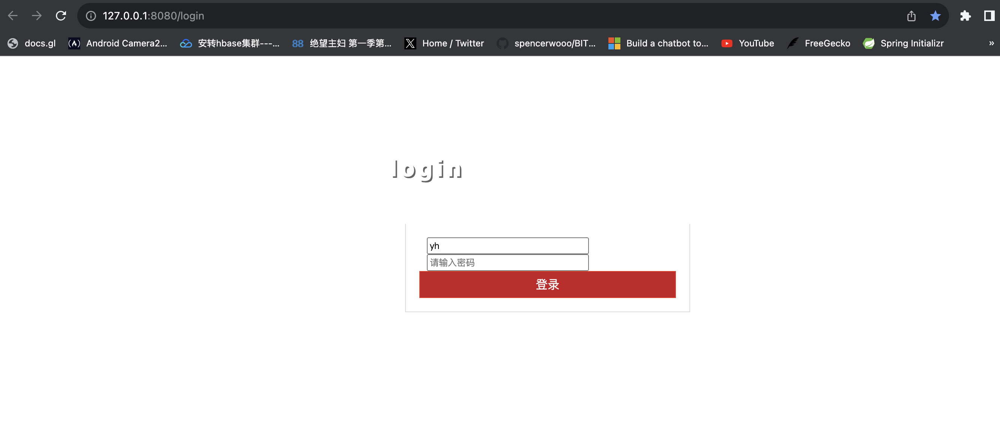
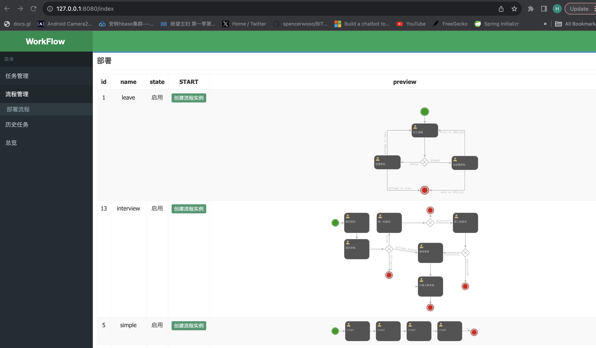
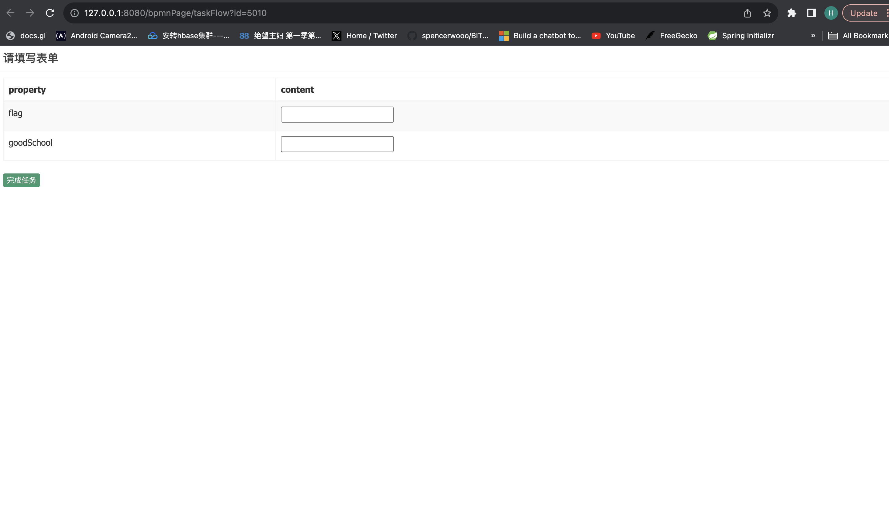
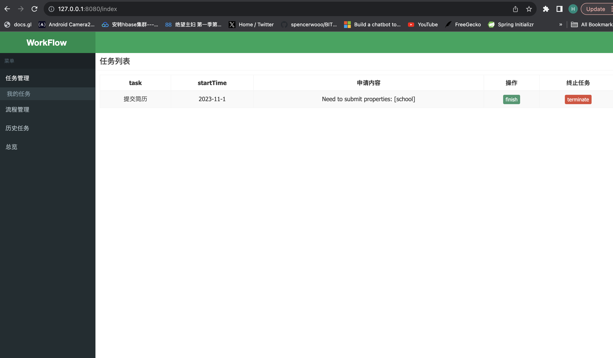
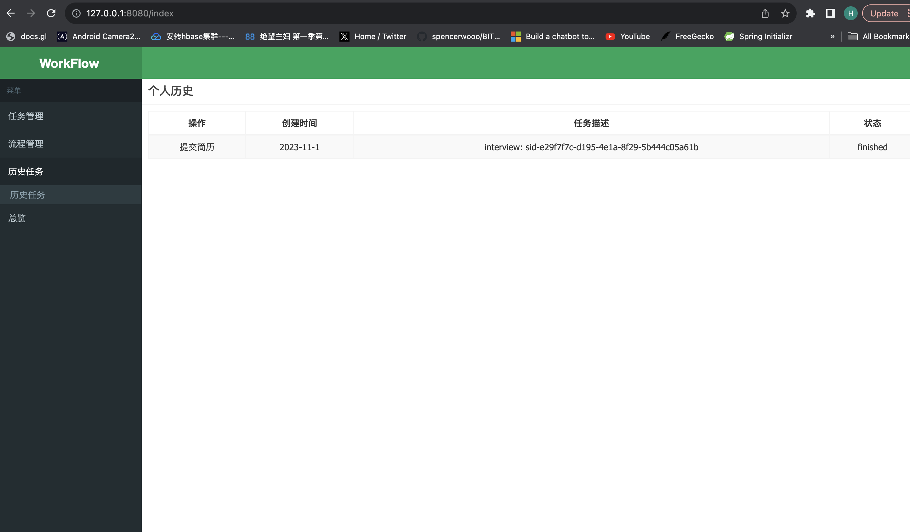
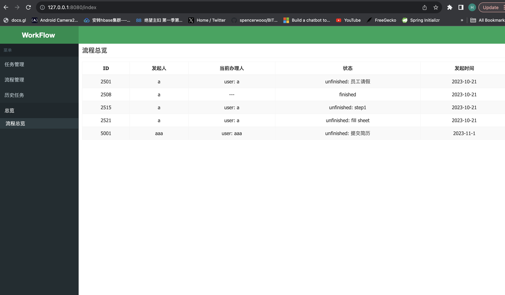

****
**流程与业务逻辑模块**

杨昊 何宇轩 张远驰
****
# 用户手册
# 环境配置
## 开发环境
Project SDK: corretto-17
数据库: MySQL 8.1.0
## 本地调试配置
### Step 1 数据库配置
安装MySQL，配置密码。
新建一个数据库activiti，并添加一个名为activiti的schema（如果不是这个名字需要修改配置文件数据库连接url）。
分别在activiti.cfg.xml文件和application.yml文件中修改密码（和用户名）。
### Step 2 依赖配置
如果MySQL为8.1.0版本，跳过该步骤。
若不是8.1.0，前往https://mvnrepository.com/ 搜索mysql找到数据库版本对应的driver jar包依赖，替换pom.xml文件中的dependency（mysql-connector-j）。替换完成后maven重新加载项目。
### Step3 初始化数据库
运行Test/java中的启动TestCreate，若activiti schema中新建了28张表，说明之前的配置正确。

## 流程部署配置
### Step1 绘制BPMN图
参考BPMN定义，选择一种支持BPMN标准的绘图工具或软件，或直接使用IDEA中的插件进行绘制。这些工具通常提供了BPMN符号的预定义库，使绘图更加简便。BPMN图由一系列标准的流程元素组成，包括任务、事件、网关、流程连接线等。使用绘图工具的工具栏选择适当的元素，然后将它们拖放到流程图中。使用连接线将不同的流程元素连接在一起，以表示它们之间的关系和流程流向。确保连接线的方向正确，以反映业务过程的流程。对于任务和事件，双击相应的符号以打开属性窗口，并输入相关信息，如任务的名称、事件的类型等。

此外，本模块支持用户自定义属性，可以按照附录所展示的规则填写在 name/ assignee/ group/ expression中进行填写。对于某一属性的获取方法需要和表单模块进行协商后，再做确定。


### Step2 生成流程图片

通过截图或者插件等辅助工具保存BPMN的预览图片，用于选择流程时的快速判定，保存的路径应该与BPMN的保存位置一致，且文件名相同。如leave.bpmn对应leave.png。

### Step3 部署

使用activiti的repositoryService进行流程部署。可以将部署过程写在测试代码包中，样例代码如下所示：
```
public class TestInitialize {
    @Test
    public void initialize(){
        ProcessEngine defaultProcessEngine = ProcessEngines.getDefaultProcessEngine();
        RepositoryService repositoryService = defaultProcessEngine.getRepositoryService();
        Deployment deploy = repositoryService.createDeployment().name("leave")
                .addClasspathResource("bpmn/leave.bpmn20.xml")
                .deploy();

        repositoryService.createDeployment().name("simple")
                .addClasspathResource("bpmn/simple.bpmn20.xml")
                .deploy();

        repositoryService.createDeployment().name("checkSheet")
                .addClasspathResource("bpmn/checkSheet.bpmn20.xml")
                .deploy();

        repositoryService.createDeployment().name("interview")
                .addClasspathResource("bpmn/interview.bpmn20.xml")
                .deploy();
    }
}
```

## 网页使用说明
1 登录
进入127.0.0.1/login，输入用户名即可登录



2 启动流程实例，选择之前已经部署的流程进行启动



3 根据提示填写启动流程或完成任务的必要字段



4 在个人任务中完成或中止任务



5 查看个人办理过的任务历史



6 监控所有流程进度




## 附：BPMN自定义属性规则
规定按如下规则定义的流程属性可以被BPMN解析模块所解析：

1 自定义属性均以${property}的格式定义，不同属性定义之间可以插入字母或汉字等符号，这些符号在解析的时候会被忽略。

2 定义在name中的自定义属性字段规定用户在完成该任务时必须填写，填写方式可以由本模块提供窗口，或者从表单模块的属性中进行获取，具体使用哪种方式需要在定义流程的时候进行协商。

3 定义在assignee和group中的自定义属性规定用户在实例化流程时必须填写，用于指定经办人或者经办用户组。

4 定义在expression内的属性由activiti进行表达式解析。


